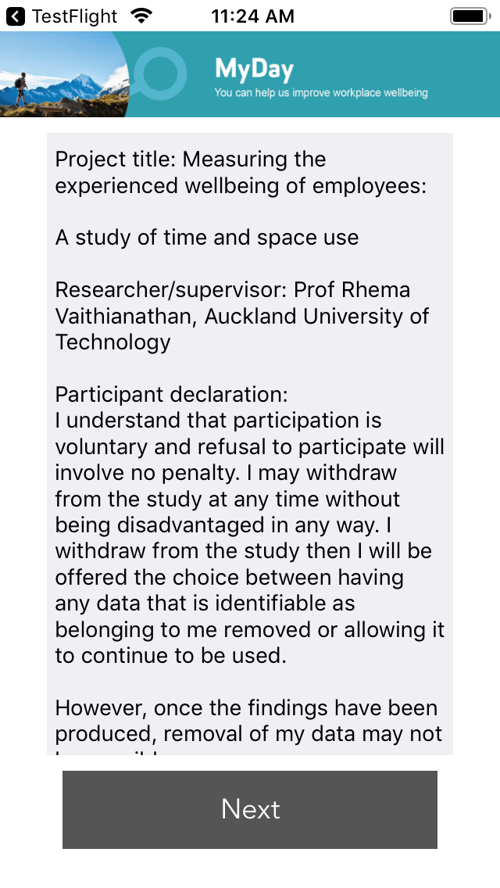
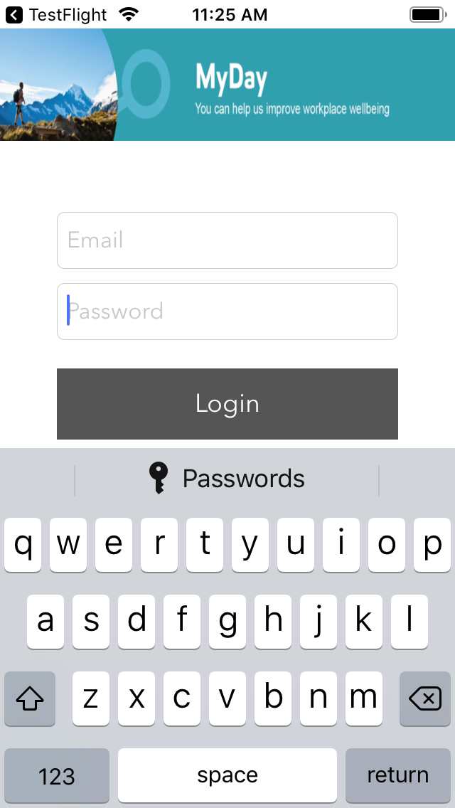
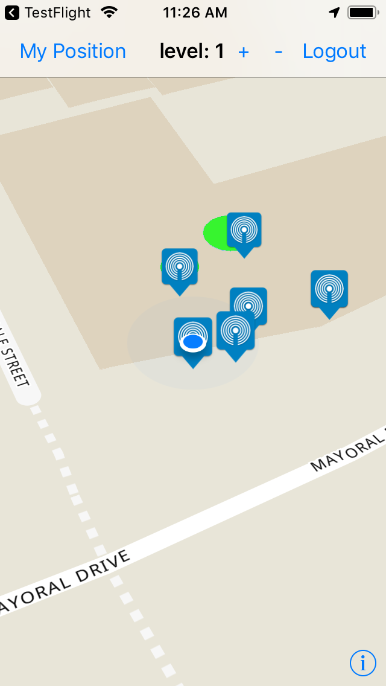

# MyDay IOS Mobile application

MyDay is an internet-based survey study of wellbeing at work. The surveys measure how an employee feels while going about their day-to-day tasks.

MyDay surveys give valuable insight into the working day experience, which provides direction to improve wellbeing at work.

<div>


</img>

</img>
</div>


## Installation
```
pod install
```
## Libraries
Firebase
API calls to Azure database
Third party location detection (Proximi.io)
